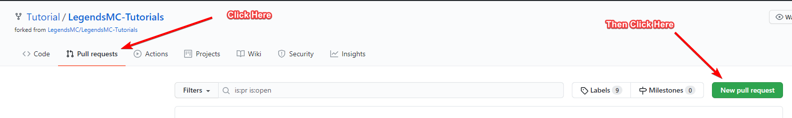

# How to contribute

## How to Modify a Tutorial


This tutorial assumes you have a **GitHub account** if you do not have one [**click here**](https://github.com/join) ****to sign up


### Step 1: Create a new fork

Once you are on our GitHub page you need to create a new for of the tutorials repository. To do this [**click here**](https://github.com/LegendsMC/LegendsMC-Tutorials/fork)\*\*\*\*

### **Step 2: Find the tutorial you want to edit**

You now have to find the tutorial you want to edit by navigating to the correct file in your forked repository for the tutorial. For example to edit this tutorial you would need to go into the **Contribute&gt;How-to-contribute.md**

### Step 3: Edit the tutorial

You can now edit the tutorial. View our tutorial on how to edit tutorials [**here**](https://tutorial.legendsmc.net/contribute/how-to-edit)\*\*\*\*

### **Step 4: Merge Changes**

You now need to merge the changes back to the original repository. To do this you need to create a new Pull Request. Don't worry this step may seem complicated but it is incredibly easy:  

### Step 5: Complete 🎉

You have now made changes to a tutorial and submitted it for review. Your changes will now be reviewed by the staff team and if required, changes will be requested.   
Once we are happy with your changes we will make your changes live

